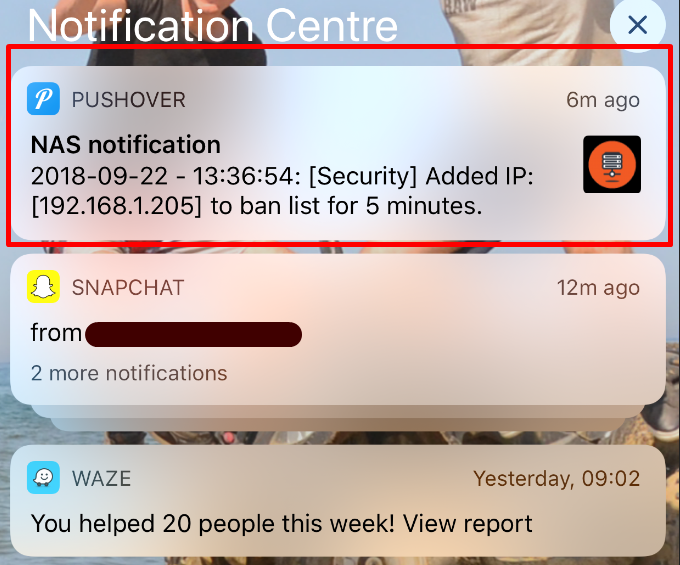

# QNAP-pushover
This project allows system notifications to be send to pushover. It runs in a docker container.

# Installation

Log via SSH into your NAS (which has docker/Container station installed).

    cd /tmp
    wget https://github.com/vincentcox/QNAP-pushover/archive/master.zip 
    unzip master.zip
    cd QNAP-pushover-master/
    # (QNAP has no package manager...)

    docker build . -t qnap-pushover

    docker run -d --rm -e LOG_TYPE="0" -e TOKEN="XXXXXX" -e USER_KEY="YYYYYYYY" -v /etc/logs/event.log:/event.log --name "QNAP-Pushover" qnap-pushover

LOG_TYPE:
- -1: everything (not recommended)
- 0: warnings and errors
- 1: errors only

# Support
This is smashed together.